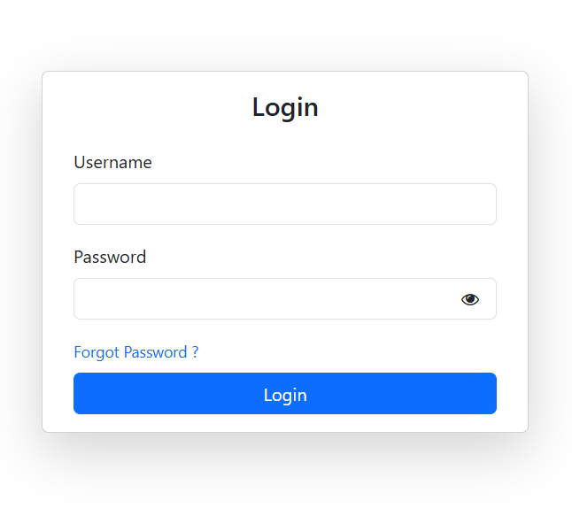
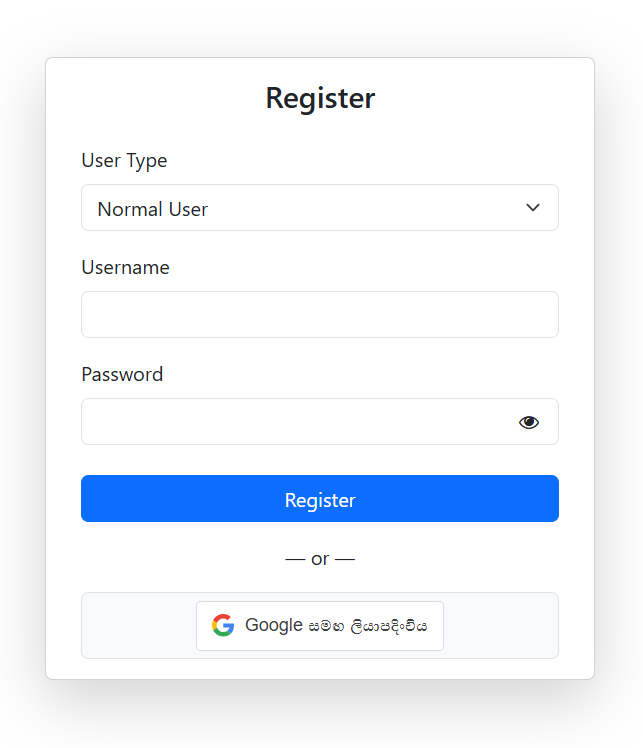
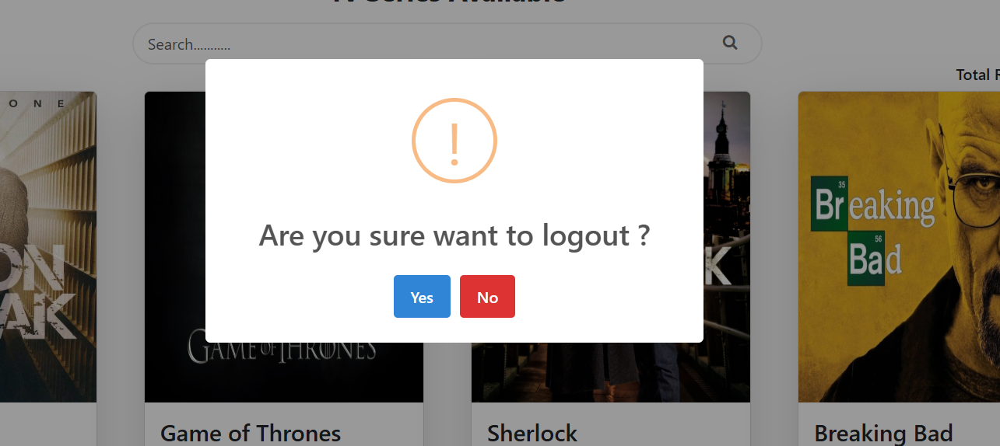
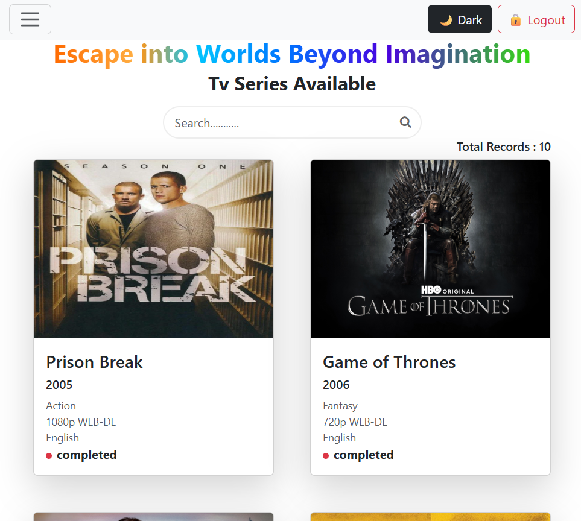

# 📺 TV Series Management System (React + Vite)

This is an **React web application** designed for managing TV series with **role-based access control** and **JWT authentication**. The application allows different types of users (Admins and Normal Users) to interact with the system based on their roles.

---

## 🔐 Features

### ✅ Authentication & Authorization

- **JWT-based authentication**
- **AuthGuard** to protect routes and restrict access for unauthorized users
- **Role-based access control** for Admin and Normal users

---

## 👤 User Roles

### 🔸 Admin

- Add new TV series
- View all added TV series
- Filter/search TV series with multiple filters
- Update existing TV series data
- Partially update TV series data
- Delete TV series from the system

### 🔹 Normal User

- View all available TV series
- Search TV series by title
- View full details of a selected TV series
- Send user requests through contact us

---

## 🛠️ Technologies & Tools Used

- **React**
- **JWT (JSON Web Tokens)**
- **React Plugins**
  - `react-select`
  - `React hooks`
  - `sweetalert`
  - `react-toastify`
  - `dompurify`
  - `react-datepicker`
  - `light-dark theme toggle`
  - `font-awesome icons`
- **Bootstrap**
- **Lazy Loading** for optimized module loading
- **Paginated API responses** from backend
- **Custom 404 Page** for invalid routes
- **Login Page**

---

## 📸 UI Snapshots
<div style="display:flex; gap:8px;">






</div>
---

### Installation

```bash
git clone https://github.com/IT19395906/tv-series-management-application-react.git
cd your-repo-name
npm install
npm run dev
